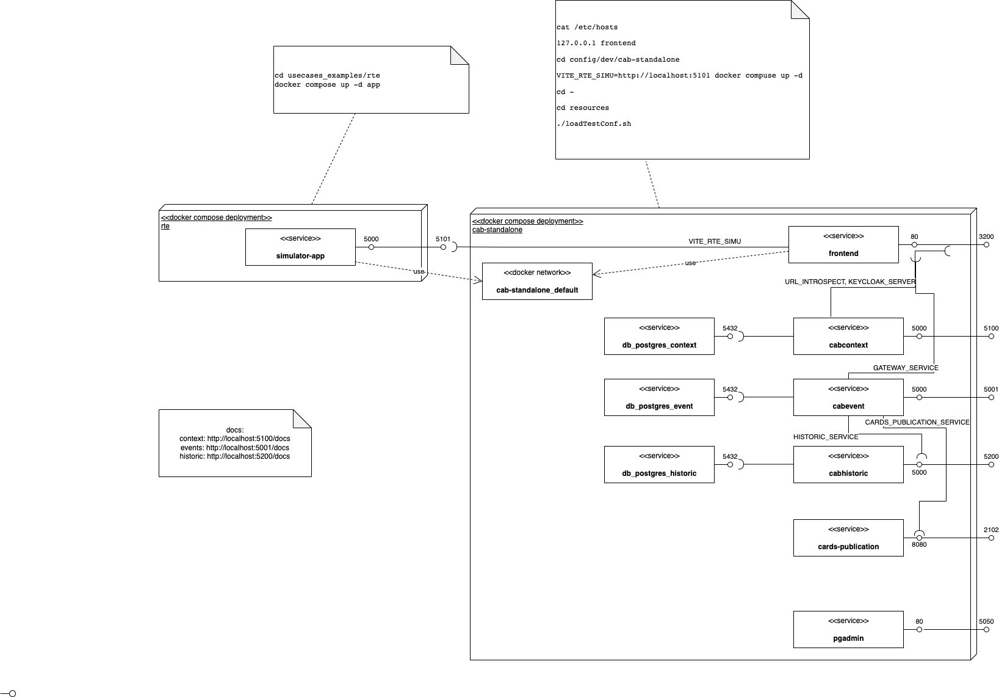

# Reverse Engineering InteractiveAI Platform

## Apidocs

* [Event-Api](http://localhost:5001/docs)
* [Context-Api](http://localhost:5100/docs)
* [Historic-Api](http://localhost:5200/docs)

## Notes

* Use cases are statically defined at build:
  e.g. `class MetadataSchemaRTE(MetadataSchema):` is located in `backend/resources`.
* Users have
* Schemas for use-case specific event types are there, but seem not published in swagger, e.g. `class MetadataSchemaRTE(MetadataSchema):` found but not
  in [Event-Api](http://localhost:5001/docs)

## Wiring

